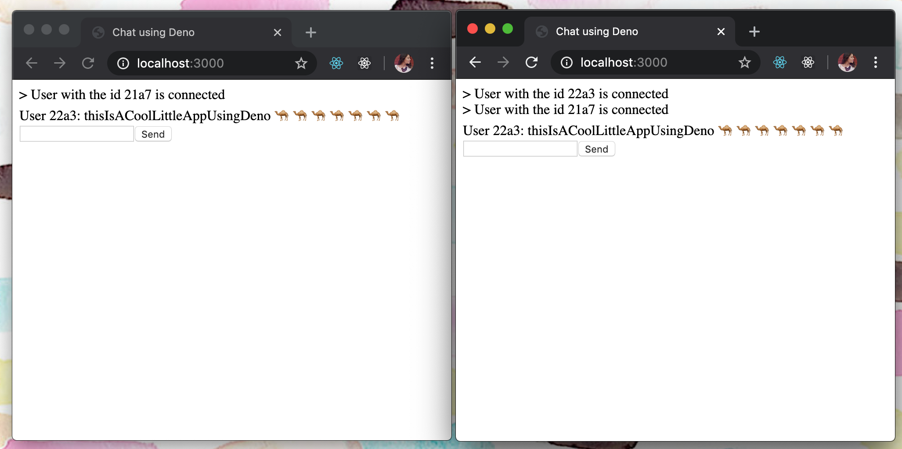

# deno-chat-app

This is a simple chat app that uses Deno!

Followed instructions from [Aral Roca's blog post](https://dev.to/aralroca/learn-deno-chat-app-37f0)

## Getting started

Run app:

`deno run --allow-net --allow-read server.ts`

Run tests:

`deno test`

Format code:

`deno fmt`